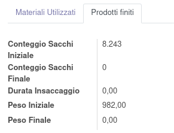

Il modulo gestisce la produzione da remoto prelevando i dati da `iot.input.data` e inserendo:

#. il peso iniziale e il peso finale nell'u.m. di riferimento (che di default è kg), da cui viene calcolato il peso totale della lavorazione. Il sistema andrà quindi ad aggiornare i pesi dei componenti della produzione distribuendo il peso sui prodotti in percentuale al peso previsto.
#. il tempo totale di insaccaggio.
#. il numero di sacchi iniziale e il numero di sacchi finale, da cui viene calcolato il numero di sacchi prodotti.

N.B.: vengono gestite solo le produzioni che hanno un centro di lavoro associato ad un input device IOT.
