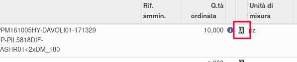
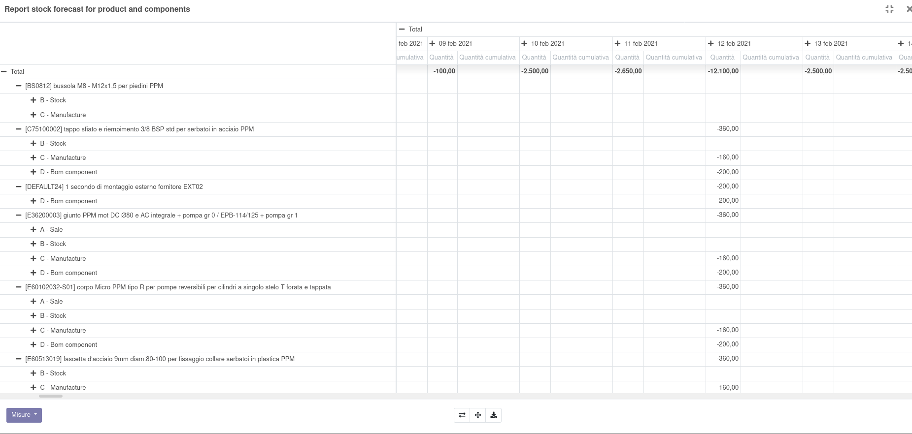

Sulla riga ordine di vendita è presente un'icona a forma di edificio:

che se cliccata genera un report pivot con le quantità disponibili per data del prodotto e dei suoi componenti nel caso abbia un distinta base:

Le quantità sono separate per documento di ordine:
# da ordine di vendita
# da magazzino
# da produzione (prodotto)
# da produzione (componente)
