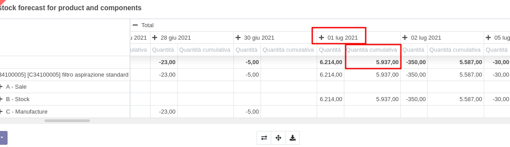
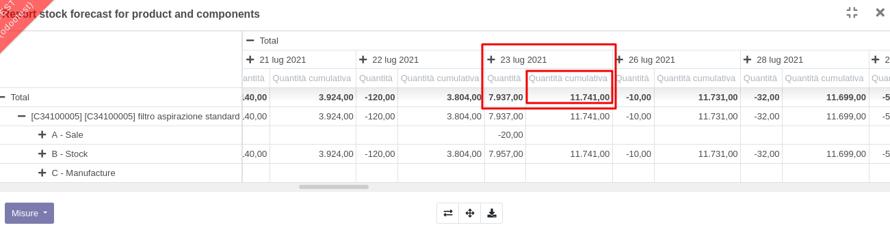

Sulla riga ordine di vendita è presente un'icona a forma di edificio:

.. image:: ../static/description/forecast_icon.png
    :alt: Forecast icon

che se cliccata genera un report pivot con le quantità disponibili per data del prodotto e dei suoi componenti nel caso abbia un distinta base:

.. image:: ../static/description/forecast_pivot.png
    :alt: Forecast pivot

Le quantità sono separate per documento di ordine:
 #. da ordine di vendita
 #. da magazzino
 #. da produzione (prodotto)
 #. da produzione (componente)

Ad es. nel caso di una richiesta per 4.662 pz la disponibilità è per questa data:

Mentre per una richiesta superiore ai 5.937 pz la disponibilità è per ques'altra data:

n.b. la disponibilità di un articolo in arrivo in magazzino il giorno x è calcolata per il giorno x+1
