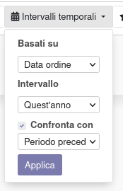
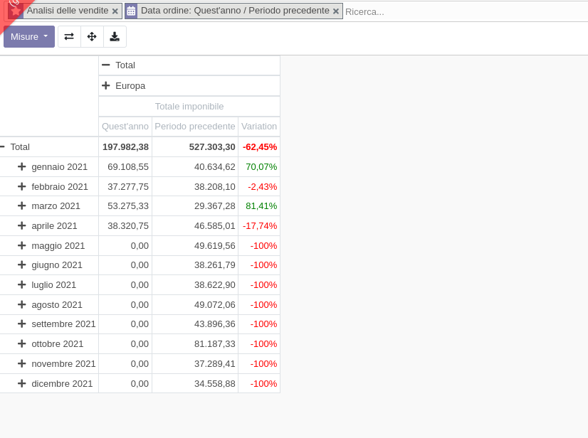

Questo modulo aggiunge dei campi data senza anno per permettere il confronto per lo stesso periodo in diversi anni. Per farlo è necessario andare nel menu Vendite > Rendicontazione > Vendite [modalità pivot] e selezionare per le righe uno dei campi data con la dicitura (senza anno) aggiunti:

.. image:: ../static/description/selezione_date_valori.png
    :alt: Selezione date valori

Questa selezione comporterà che a video risulteranno solo le date (mesi, giorni, settimane, ecc.) con la dicitura dell'anno in corso, anche se i dati non sono filtrati per l'anno in corso (ATTENZIONE!) in quanto il filtro per date sarà basato sull'intervallo temporale:

Alla fine si ottiene quindi una statistica che confronta i valori in maniera logica, invece di vedere diverse righe separate per ogni anno e non confrontate:

