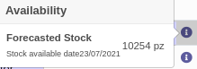
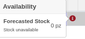

Sulla riga ordine di vendita è presente un'icona (i) quando:
 #. l'ordine non ha una data di impegno;
 #. la riga non ha una data di impegno.

L'icona è in blu quando il sistema trova una disponibilità futura a stock del prodotto. È in rosso in caso contrario.

Quando l'icona è in blu mostra la quantità disponibile per coprire la richiesta alla prima data possibile, senza che questo prelievo incida sullo stock in modo da farlo diventare negativo.

Es. con una richiesta di 1 pz con un ordine alla data odierna del 01/07/2021 la disponibilità è immediata:

.. image:: ../static/description/richiesta_quantita.png
    :alt: Richiesta quantità iniziale

in quanto l'articolo è disponibile e lo stock previsto finale è superiore alla quantità richiesta. Con una richiesta di 4.662 pz la disponibilità è per il:

in quanto l'articolo ha una quantità sufficiente a partire da quella data, e la quantità prevista finale è superiore a quella richiesta.

Quando l'icona è rossa segnala che non è possibile fornire da stock il prodotto:

