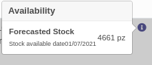
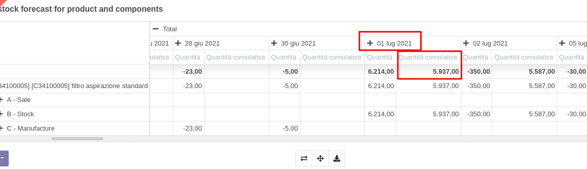
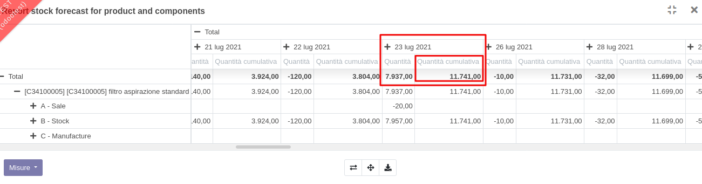
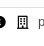

Sulla riga ordine di vendita è presente un'icona (i) quando:
1. l'ordine non ha una data di impegno;
2. la riga non ha una data di impegno.

L'icona è in blu quando il sistema trova una disponibilità futura a stock del
prodotto. È in rosso in caso contrario.

Quando l'icona è in blu mostra la quantità disponibile per coprire la richiesta
alla prima data possibile, senza che questo prelievo incida sullo stock in modo
da farlo diventare negativo.

Es. con una richiesta di 1 pz la disponibilità è immediata:

in quanto l'articolo è disponibile e lo stock previsto finale è superiore alla
quantità richiesta:

Con una richiesta di 4.662 pz la disponibilità è per il

in quanto l'articolo ha una quantità sufficiente a partire da quella data, e la
quantità prevista finale è superiore a quella richiesta:

n.b.: quest'ultima vista si apre dall'icona seguente disponibile sulla riga
dell'ordine di vendita, e mostra nel dettaglio i dati da cui sono desunte le
informazioni sopra:

n.b. la disponibilità di un articolo in arrivo in magazzino il giorno x è calcolata per il giorno x+1
