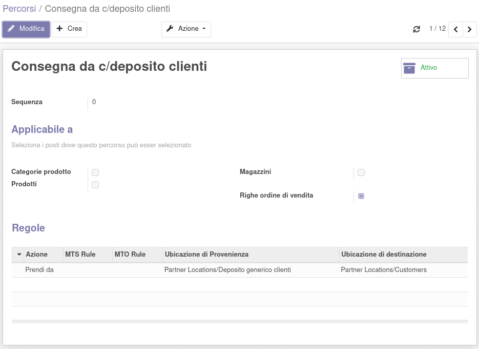
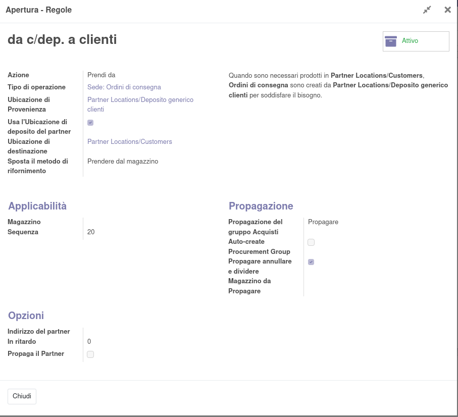
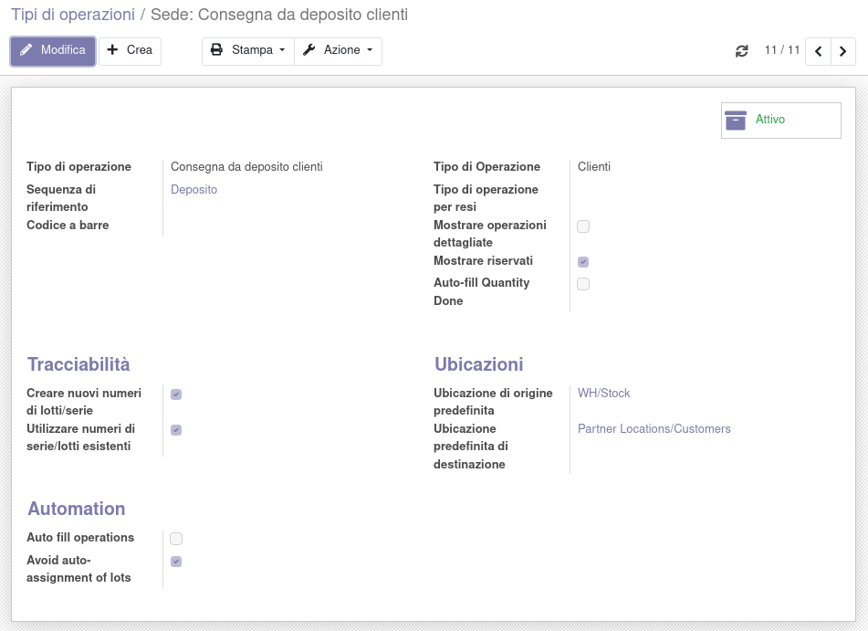
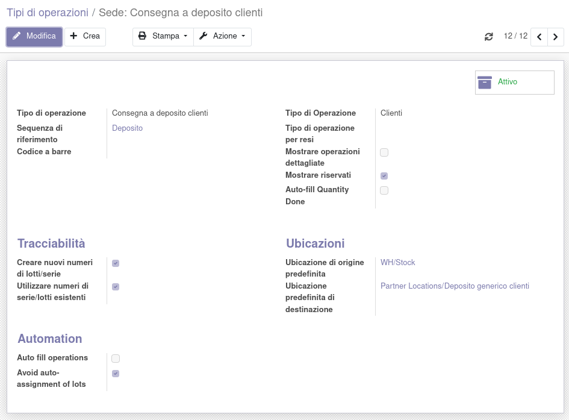
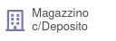

Nel partner è stata aggiunta l'ubicazione di deposito, che va creata specifica per il partner:

crendo e impostando come padre l'ubicazione generica deposito partner:

Va quindi attivata l'opzione per le rotte specifiche sugli ordini di vendita:

e va creato il percorso generico per la vendita da conto deposito:

in cui andrà creata la regola come segue:

Questo percorso verrà usato in maniera generica per qualsiasi trasferimento/vendita di questo tipo, in quanto l'ubicazione di prelievo verrà rilevata dal partner.

È necessario creare un tipo di operazione per la consegna dal conto deposito:

e un tipo di operazione per la consegna al conto deposito:

con l'ubicazione di destinazione predefinita del deposito generico.

Facendo quindi una vendita con il percorso definito sopra verso un cliente che ha un deposito, il trasferimento partirà dal deposito specifico:

.. image:: ../static/description/trasferimento_vendita.png
    :alt: trasferimento vendita

Dal partner è possibile aprire direttamente lo stock in deposito presso l'ubicazione con il bottone:

