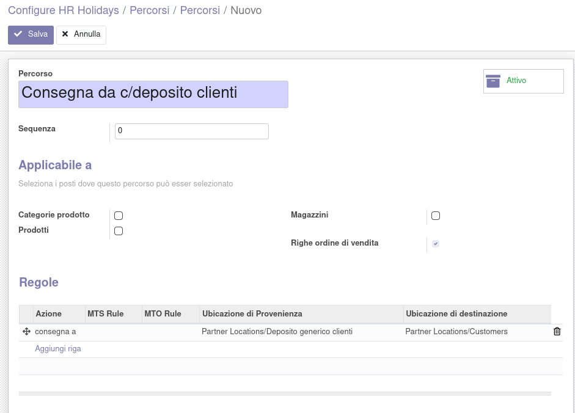
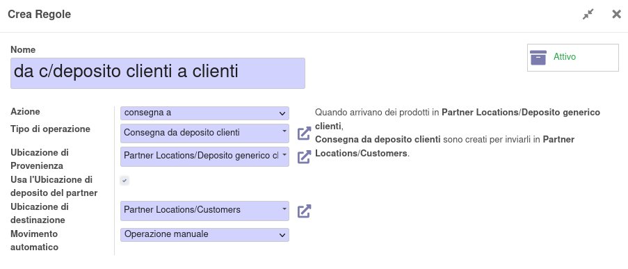

Nel partner è stata aggiunta l'ubicazione di deposito, che va creata specifica per il partner:

.. image:: ../static/description/partner.png
    :alt: partner

Va quindi attivata l'opzione per le rotte specifiche sugli ordini di vendita:

.. image:: ../static/description/attivazione_rotte_so.png
    :alt: attivazione rotte ordine di vendita

e va creato il percorso generico per la vendita da conto deposito:

in cui andrà creata la regola come segue:

Questo percorso verrà usato in maniera generica per qualsiasi trasferimento/vendita di questo tipo, in quanto l'ubicazione di prelievo verrà rilevata dal partner.

È necessario creare un tipo di operazione per la consegna dal conto deposito:

.. image:: ../static/description/operazione_consegna_da_deposito.png
    :alt: operazione consegna da deposito

con l'ubicazione di origine predefinita:

.. image:: ../static/description/ubicazione_generica_deposito.png
    :alt: ubicazione generica deposito
