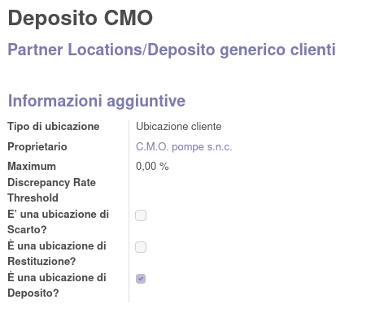
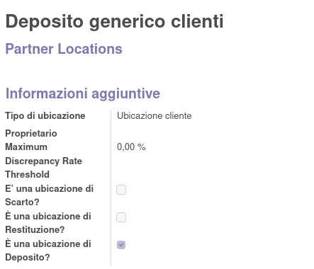

**- Nel partner è stata aggiunta l'ubicazione di deposito, che va creata specifica per il partner:**

**- creando e impostando come padre l'ubicazione generica deposito partner:**

**- che sarà quindi visibile nel partner nel tab "Vendite e acquisti" del partner:**

**- Va quindi attivata l'opzione per le rotte specifiche sugli ordini di vendita:**

.. image:: ../static/description/attivazione_rotte_so.png
    :alt: attivazione rotte ordine di vendita

**- e va creato il percorso generico per la vendita da conto deposito, impostando che possa essere utilizzato dalle righe degli ordini di vendita:**

**- in cui andrà creata la regola come segue:**

**Questo percorso verrà usato in maniera generica per qualsiasi trasferimento/vendita di questo tipo, in quanto l'ubicazione di prelievo verrà rilevata dal partner.**

**- È quindi possibile creare i tipi di operazione per gestire il conto deposito. Ad esempio, sarà utile creare un'operazione per la consegna al conto deposito, indicando l'ubicazione di destinazione predefinita del deposito generico.:**

**- un'operazione di rientro dal deposito:**

**- e un'operazione di consegna e fatturazione dal deposito al cliente:**

**Ci sono quindi 2 possibilità di fatturazione con scarico del deposito:**

**#- creare a mano una vendita con il percorso definito sopra verso un cliente che ha un deposito**
**#- creare automaticamente una vendita dal trasferimento**

**1. Nel caso della vendita va creata impostando manualmente il percorso:**

.. image:: ../static/description/percorso_vendita.png
    :alt: percorso vendita

**per cui il trasferimento partirà dal deposito specifico:**

.. image:: ../static/description/trasferimento_vendita.png
    :alt: trasferimento vendita

**- Dal partner è possibile aprire direttamente lo stock in deposito presso l'ubicazione con il bottone:**

.. image:: ../static/description/deposito_partner.png
    :alt: deposito del partner

**2. Nel caso del trasferimento automatico, la vendita va creata automaticamente dal magazzino dalla procedura di spostamento tra ubicazioni, che provvede in automatico a generare il trasferimento che risulta quindi collegato e fatturabile con la procedura abituale.**

**Aprendo la procedura di spostamento tra ubicazioni con il bottone:**

**se viene selezionato un cliente con un deposito, verrà creato in automatico un ordine di vendita con lo scarico dal c/deposito:**

