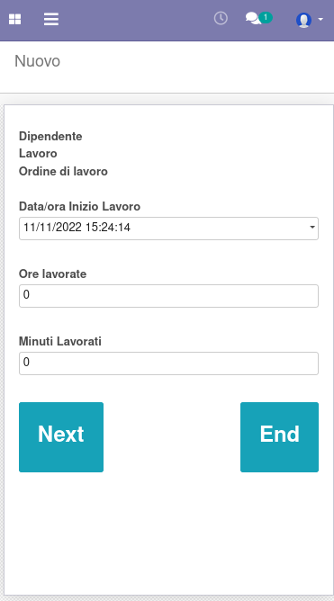

Questo modulo aggiunge una procedura nel menu Presenze per registrare i tempi di lavorazione sulle attività dei progetti e sulle produzioni tramite lettura di codice a barre.

.. image:: ../static/description/menu.png
    :alt: Menu

È utile creare un utente con il solo permesso Presenza manuale, da loggare in maniera costante:

.. image:: ../static/description/utente.png
    :alt: Utente

e impostando l'azione pagina iniziale con la procedura creata dal modulo:

.. image:: ../static/description/menu_default.png
    :alt: Utente

L'utente che vuole registrare i tempi di lavorazione provvederà quindi a scansionare il proprio tesserino, un'attività oppure un ordine di lavoro e indicare quindi le ore ed i minuti da registrare, validando infine con il bottone Completato:

