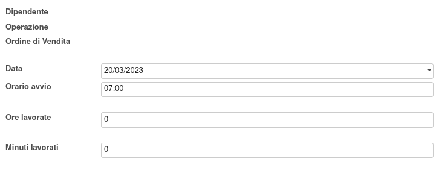
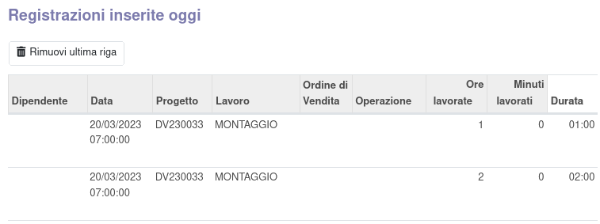

Questo modulo aggiunge una procedura nel menu Presenze per registrare i tempi di lavorazione sulle attività dei progetti e sulle produzioni tramite lettura di codice a barre.

È utile creare un utente con il solo permesso Presenza manuale, da loggare in maniera costante:

e impostando l'azione pagina iniziale con la procedura creata dal modulo:

L'utente che vuole registrare i tempi di lavorazione provvederà quindi a scansionare il proprio tesserino, un'attività oppure un ordine di lavoro e indicare quindi le ore ed i minuti da registrare:

validando infine con il bottone Salva. Inoltre, in base alle presenze registrate dall'utente in giornata, il sistema mostrerà a video le ore lavorate e le ore di cui non è ancora stata imputata l'attività:

In fondo alla schermata sono visibili le registrazioni effettuate nella data odierna dall'operatore:

