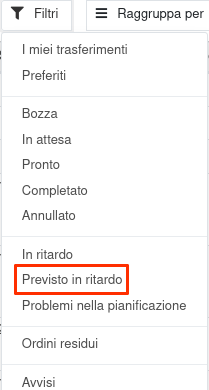
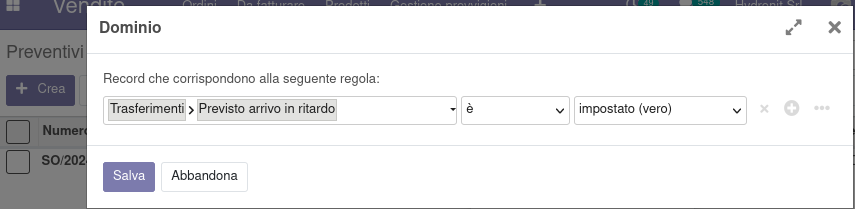
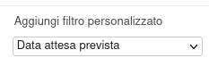

Questo modulo aggiunge un filtro *Previsto in ritardo* sulla ricerca dei trasferimenti che mostra quelli in cui c'è almeno un movimento la cui data programmata sarà sforata in base al previsto arrivo del prodotto in magazzino:

Aggiunge inoltre due campi: il primo è *Previsto arrivo in ritardo* che può essere usato negli oggetti *Trasferimento*, *Movimento di magazzino* e in oggetti superiori, tipo ordini di vendita, di acquisto, di produzione, ecc., tramite il filtro avanzato:

Il secondo è *Data attesa prevista* che può essere usato come il precedente negli oggetti *Trasferimento*, *Movimento di magazzino* e in oggetti superiori, tipo ordini di vendita, di acquisto, di produzione, ecc., tramite il filtro avanzato:

